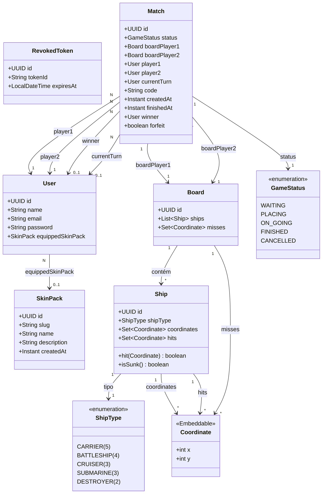

# ⚓ Naval Strike - Backend

API back-end do jogo **Naval Strike** — uma implementação multiplayer online do clássico Batalha Naval, com comunicação em tempo real via WebSocket, sistema de autenticação JWT e personalização com skins.

<div align="center">


</div>

---

## 📋 Índice

- [Visão Geral](#visão-geral)
- [Stack Tecnológica](#stack-tecnológica)
- [Arquitetura](#arquitetura)
- [Modelo de Dados](#modelo-de-dados)
- [Funcionalidades](#funcionalidades)
- [Justificativas Técnicas](#justificativas-técnicas)
- [Como Executar](#como-executar)
- [Variáveis de Ambiente](#variáveis-de-ambiente)
- [Endpoints Principais](#endpoints-principais)

---

## Visão Geral

Naval Strike é um jogo de Batalha Naval multiplayer onde dois jogadores se enfrentam em tempo real. A API gerencia todo o ciclo de vida de uma partida: criação de sala, posicionamento de navios, ataques por turno, detecção de vitória e notificações via WebSocket.

---

## Stack Tecnológica

| Camada | Tecnologia | Versão |
|--------|-----------|--------|
| Linguagem | Java | 21 (preview features) |
| Framework | Spring Boot | 4.1.0 |
| Persistência | Spring Data JPA + Hibernate | — |
| Banco de Dados | PostgreSQL | — |
| Migrações | Flyway | — |
| Segurança | Spring Security + JWT (Auth0 java-jwt) | 4.4.0 |
| Tempo Real | Spring WebSocket (STOMP + SockJS) | — |
| Validação | Spring Validation (Bean Validation) | — |
| Utilitário | Lombok | — |
| Testes | Spring Boot Test + H2 (in-memory) | — |
| Build | Maven (wrapper) | — |
| Container | Docker (multi-stage build) | Eclipse Temurin 21 |
| Deploy | Render (API) + Vercel (Frontend) | — |

---

## Arquitetura

O projeto segue uma **arquitetura em camadas orientada a domínio**, organizada por feature/módulo:

```
src/main/java/com/projeto/navalstrikeAPI/
├── common/                    # Código compartilhado
│   ├── enums/                 #   GameStatus, ShipType
│   └── exception/             #   Exceções de domínio + GlobalExceptionHandler
├── domain/                    # Módulos de domínio (feature-based)
│   ├── user/                  #   Autenticação e perfil
│   │   ├── controller/
│   │   ├── service/
│   │   ├── repository/
│   │   ├── entity/
│   │   └── dto/
│   ├── match/                 #   Gerenciamento de partidas
│   │   ├── controller/
│   │   ├── service/
│   │   ├── repository/
│   │   ├── entity/
│   │   └── dto/
│   ├── board/                 #   Tabuleiro e lógica de ataques
│   │   ├── service/
│   │   ├── repository/
│   │   ├── entity/
│   │   └── dto/
│   ├── ship/                  #   Navios e posicionamento
│   │   ├── service/
│   │   ├── repository/
│   │   ├── entity/
│   │   └── dto/
│   ├── coordinate/            #   Value Object de coordenadas
│   │   └── entity/
│   ├── ranking/               #   Ranking de jogadores
│   │   ├── controller/
│   │   ├── service/
│   │   ├── repository/
│   │   └── dto/
│   └── skin/                  #   Sistema de skins/personalização
│       ├── controller/
│       ├── service/
│       ├── repository/
│       ├── entity/
│       └── dto/
└── infra/                     # Infraestrutura e cross-cutting concerns
    ├── security/              #   SecurityConfig, JwtService, JwtFilter
    ├── websocket/             #   Config STOMP, interceptors, notificações
    └── transaction/           #   Helper transacional
```

### Padrões Adotados

- **Package by Feature**: cada módulo de domínio é autocontido com controller, service, repository, entity e DTOs
- **Layered Architecture**: separação clara entre apresentação (controllers), lógica de negócio (services) e acesso a dados (repositories)
- **DTOs (Records)**: isolamento entre camadas, controle do contrato da API
- **Global Exception Handler**: tratamento centralizado de erros com respostas padronizadas
- **Stateless Authentication**: JWT sem sessão no servidor, com suporte a revogação de tokens

---

## Modelo de Dados



---

## Funcionalidades

### 🎮 Gameplay
- Criar partida (gera código de 6 caracteres para convite)
- Entrar em partida por código
- Posicionar navios no tabuleiro (com validação de overlap e limites)
- Atacar coordenadas do adversário (sistema de turnos)
- Detecção automática de vitória (todos os navios afundados)
- Desistência (forfeit)
- Histórico de partidas com estatísticas globais (vitórias e derrotas totais)
- Ranking de jogadores com paginação e ordenação (victories, defeats, totalMatches)

### 🔐 Autenticação
- Registro e login com JWT
- Refresh de token
- Logout com revogação de token
- Proteção de rotas via Spring Security

### 🌐 Tempo Real (WebSocket)
- Notificações STOMP via `/topic`
- Eventos: jogador entrou, navios posicionados, ataque realizado, jogo finalizado
- Detecção de desconexão com timer de reconexão
- Autenticação no handshake WebSocket

### 🎨 Skins
- Packs de skins identificados por slug
- Assets resolvidos por convenção de path no frontend (`/skins/{slug}/{shipType}.png`)
- Equipar/desequipar skin pack
- Listagem de packs disponíveis

---

## Justificativas Técnicas

| Escolha | Justificativa |
|---------|---------------|
| **Java 21 + Spring Boot 4.1** | Ecossistema maduro, tipagem forte para lógica de jogo complexa, Virtual Threads (preview) para alta concorrência em WebSocket |
| **PostgreSQL** | ACID compliance para consistência do estado do jogo, UUID nativo (`gen_random_uuid()`), constraints compostas para integridade |
| **Flyway** | Versionamento do schema, reprodutibilidade entre ambientes, seed de dados iniciais via migrations |
| **JWT (Stateless)** | Escalabilidade horizontal sem sessão no servidor, compatível com autenticação no handshake WebSocket, revogação via tabela dedicada |
| **WebSocket (STOMP + SockJS)** | Comunicação instantânea essencial para multiplayer em turnos, tópicos por partida, fallback SockJS, detecção de desconexão com timer |
| **Docker (Multi-stage)** | Imagem otimizada (build JDK / runtime JRE), cache de layers com `dependency:resolve`, deploy portável |
| **Package by Feature** | Alta coesão por módulo, baixo acoplamento entre features, fácil navegação e escalabilidade do código |

---

## Como Executar

### Pré-requisitos
- Java 21+
- PostgreSQL
- Docker (opcional)

### Localmente

```bash
# Clone o repositório
git clone <repo-url>
cd navalstrikeAPI/navalstrikeAPI

# Configure as variáveis de ambiente (veja seção abaixo)
cp src/main/resources/application-example.properties src/main/resources/application-dev.properties

# Execute
./mvnw spring-boot:run -Dspring-boot.run.profiles=dev
```

### Com Docker

```bash
# Na raiz do projeto
docker build -t navalstrike-api .
docker run -p 8080:8080 --env-file .env navalstrike-api
```

---

## Variáveis de Ambiente

| Variável | Descrição |
|----------|-----------|
| `DATABASE_URL` | URL JDBC do PostgreSQL (ex: `jdbc:postgresql://localhost:5432/navalstrike`) |
| `DATABASE_USERNAME` | Usuário do banco |
| `DATABASE_PASSWORD` | Senha do banco |
| `JWT_SECRET` | Chave secreta para assinatura dos tokens JWT |

---

## Endpoints Principais

| Método | Rota | Descrição |
|--------|------|-----------|
| POST | `/auth/register` | Registro de usuário |
| POST | `/auth/login` | Login (retorna JWT) |
| POST | `/auth/logout` | Logout (revoga token) |
| POST | `/matches` | Criar partida |
| POST | `/matches/join` | Entrar por código |
| POST | `/matches/{id}/place-ships` | Posicionar navios |
| POST | `/matches/{id}/attack` | Atacar coordenada |
| GET | `/matches/{id}` | Estado da partida |
| GET | `/matches/history?page=0&size=10` | Histórico paginado com estatísticas globais |
| GET | `/ranking` | Ranking paginado com ordenação |
| GET | `/skins/packs` | Listar packs de skins |
| POST | `/skins/equip` | Equipar skin pack |

### WebSocket

- **Endpoint**: `ws://host/ws` (SockJS)
- **Tópico**: `/topic/match/{matchId}`
- **Eventos**: `PLAYER_JOINED`, `SHIPS_PLACED`, `ATTACK`, `GAME_OVER`, `PLAYER_DISCONNECTED`

---

## Licença

Este projeto é de uso acadêmico/pessoal.
