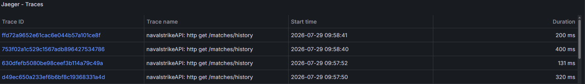
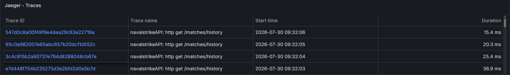

# Otimização de Performance — /matches/history

## Problema

O endpoint `GET /matches/history` apresentava latências altas em produção, identificado via tracing com Jaeger/OpenTelemetry.

### Trace antes da otimização



---

## Diagnóstico

Através da análise dos traces e do código, foram identificadas três causas:

### 1. N+1 Queries (EAGER Loading)

A entidade `Match` possuía 6 relacionamentos `@ManyToOne` sem `FetchType.LAZY`. O Hibernate carregava **todos** automaticamente a cada Match retornado:

- `boardPlayer1` → Board → Ships → Coordinates
- `boardPlayer2` → Board → Ships → Coordinates
- `player1`, `player2`, `currentTurn`, `winner`

Para 10 matches no histórico, isso gerava **~30-60 queries** ao banco.

### 2. Ausência de JOIN FETCH

Mesmo com LAZY, sem JOIN FETCH cada acesso a `match.getPlayer1().getName()` dispara uma query separada (lazy load individual).

### 3. Contagens sem cache

As queries de `countVictories` e `countDefeats` eram executadas a cada request, mesmo sendo dados que só mudam ao finalizar uma partida. Sem cache, eram 2 COUNTs desnecessários no banco a cada chamada.

---

## Soluções Implementadas

### FetchType.LAZY

Todos os 6 `@ManyToOne` da entidade `Match` foram alterados para carregamento lazy:

```java
@ManyToOne(fetch = FetchType.LAZY)
@JoinColumn(name = "board_player_1_id")
private Board boardPlayer1;
// ... (todos os 6 relacionamentos)
```

Relacionamentos só são carregados quando explicitamente acessados dentro de uma transação.

### JOIN FETCH

A query do histórico agora traz player1, player2 e winner em uma única query SQL:

```java
@Query(value = "SELECT m FROM Match m " +
       "JOIN FETCH m.player1 " +
       "JOIN FETCH m.player2 " +
       "LEFT JOIN FETCH m.winner " +
       "WHERE m.status = 'FINISHED' AND (m.player1 = :player OR m.player2 = :player) " +
       "ORDER BY m.finishedAt DESC",
       countQuery = "SELECT COUNT(m) FROM Match m " +
       "WHERE m.status = 'FINISHED' AND (m.player1 = :player OR m.player2 = :player)")
Page<Match> findFinishedByPlayer(User player, Pageable pageable);
```

### Cache com Caffeine

Implementado cache para as contagens de vitórias/derrotas em um service dedicado (`PlayerStatsService`). O service separado é necessário para que o `@Cacheable` funcione , chamadas internas na mesma classe não passam pelo proxy AOP do Spring:

```java
@Service
public class PlayerStatsService {

    @Cacheable(value = "playerStats", key = "#playerId")
    public PlayerStatsDTO getPlayerStats(UUID playerId) {
        // COUNTs de vitórias e derrotas
    }
}
```

O cache é invalidado automaticamente ao finalizar uma partida (attack com game over ou forfeit). Configurado com Caffeine (TTL 5min, max 500 entries).

---

## Resultado

| Métrica | Antes          | Depois           |
|---------|----------------|------------------|
| Latência média | ~250ms         | ~20ms            |
| Queries por request | ~30-60         | 1-2              |
| Cache de stats | Não funcionava | Ativo (TTL 5min) |

### Trace após a otimização



---

## Resumo de mudanças

| Arquivo | Alteração |
|---------|-----------|
| `Match.java` | `FetchType.LAZY` nos 6 `@ManyToOne` |
| `MatchRepository.java` | `JOIN FETCH` na query `findFinishedByPlayer` |
| `PlayerStatsService.java` | Novo service com `@Cacheable` funcional |
| `MatchQueryService.java` | Delegou stats para `PlayerStatsService` |
| `MatchService.java` | Evict do cache ao finalizar partida |
| `CacheConfig.java` | Configuração Caffeine (TTL 5min, max 500 entries) |
