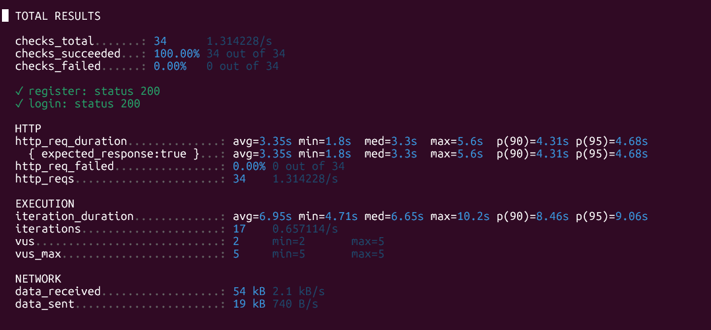
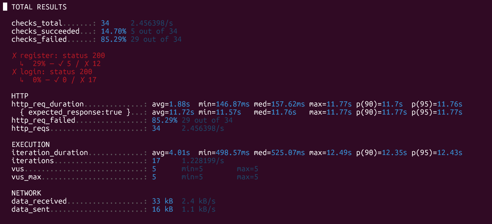

# Teste de Carga - Rate Limiting (Antes e Depois)

## Objetivo

Implementar rate limiting como mecanismo de proteção contra requisições demasiadas nos endpoints de autenticação (`/auth/register` e `/auth/login`).

## Ferramenta

- **k6** (v2.1.0) — teste de carga open-source

## Cenário do Teste

- **Iterações**: 17 (cada iteração faz 1 registro + 1 login = 34 requests)
- **VUs simultâneos**: 5
- **Alvo**: API em produção (Render)
- **Endpoints testados**: `POST /auth/register` e `POST /auth/login`

---

## Antes do Rate Limiting

| Métrica | Resultado |
|---------|-----------|
| Requests totais | 34 |
| Requests bloqueados | 0 (0%) |
| Taxa de erro HTTP | 0% |
| Latência média | 3.35s |
| Latência p95 | 4.68s |
| Throughput | 1.31 req/s |
| Checks passando | 100% (34/34) |

### Output k6

```
http_req_duration..............: avg=3.35s min=1.8s  med=3.3s  max=5.6s  p(90)=4.31s p(95)=4.68s
http_req_failed................: 0.00% 0 out of 34
http_reqs......................: 34    1.314228/s
```

### Conclusão

Sem rate limiting, todas as 34 requisições foram aceitas sem nenhuma restrição. Um atacante poderia criar contas em massa ou realizar ataques de brute force no login sem ser barrado.



---

## Depois do Rate Limiting

| Métrica | Resultado |
|---------|-----------|
| Requests totais | 34 |
| Requests bloqueados (429) | 29 (85.3%) |
| Requests aceitos | 5 (14.7%) |
| Taxa de erro HTTP | 85.29% |
| Latência média (bloqueados) | ~157ms |
| Latência média (aceitos) | 11.72s |
| Throughput | 2.45 req/s |

### Output k6

```
http_req_duration..............: avg=1.88s  min=146.87ms med=157.62ms max=11.77s p(90)=11.7s  p(95)=11.76s
http_req_failed................: 85.29% 29 out of 34
http_reqs......................: 34     2.456398/s

checks_succeeded...: 14.70% 5 out of 34
  register: status 200 — 29% (✓ 5 / ✗ 12)
  login: status 200    —  0% (✓ 0 / ✗ 17)
```

### Conclusão

Com rate limiting ativo (5 requisições/minuto por IP), apenas 5 das 34 requisições foram aceitas. As demais 29 foram bloqueadas imediatamente com status 429 (Too Many Requests), com tempo de resposta de ~157ms.



---

## Comparativo

| Métrica | Antes | Depois |
|---------|-------|--------|
| Requests aceitos | 34 (100%) | 5 (14.7%) |
| Requests bloqueados (429) | 0 (0%) | 29 (85.3%) |
| Latência média | 3.35s | 157ms (bloqueados) |
| Throughput | 1.31 req/s | 2.45 req/s |
| Proteção |  Nenhuma |  Rate limiting ativo (5 req/min por IP) |
